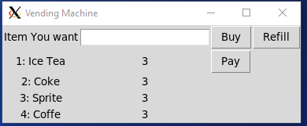

1). Homework 3- I want to be able to generate a vending machine instance that will keep an inventory.
I intend to make a simple gui interface of a Vending machine with a number pad style input. 
The gui should have a placeholder for a qr code once i get the payment request figured out. 
The GUI should have a few different snacks that will decrease in number when a request is inputted on the number pad.
The gui should also be able to refill with a button push.
2) I was able to make a simple GUI where you can type in the Number of the Item.
You are able to refill the vending machine back up to 5 items at any time
There is a large bitcoin Symbol as a place holder for the QR code.
I did not implement a numberpad style input because I figured for testing purposses its easier to type it in
3)  By my next Homework I should have a Bitcoin node running on a Raspberry Pi
The node should be able to produce a payment request and tell when it has been fufilled. 
If I can get the Bitcoin Node up and running sooner then expected then I will also attempt to send the payment request to the GUI
4.
Here is what it looks when you start

